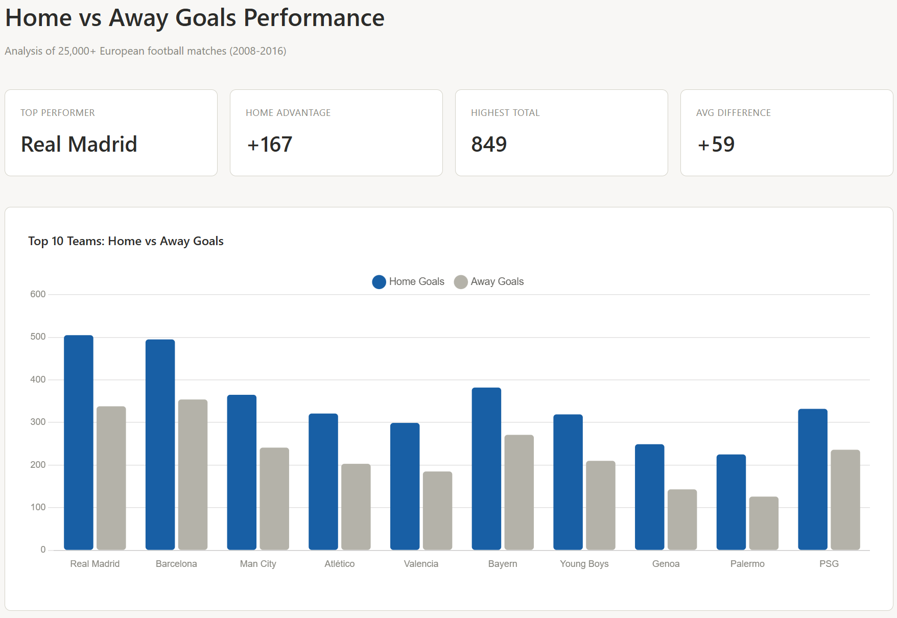
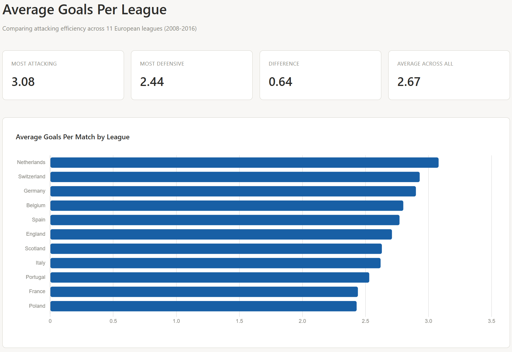
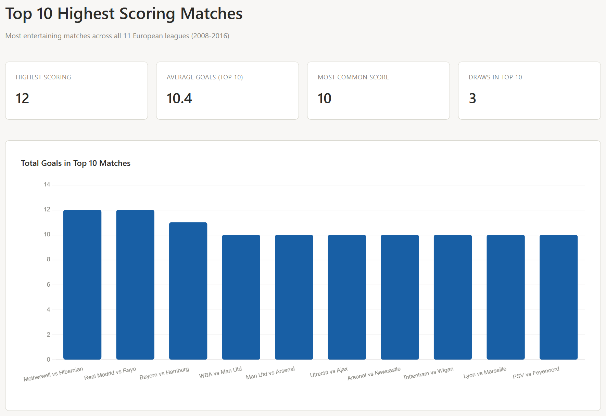
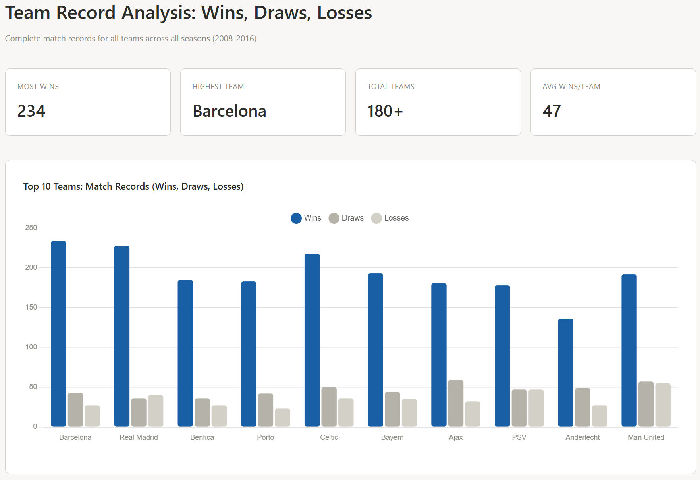
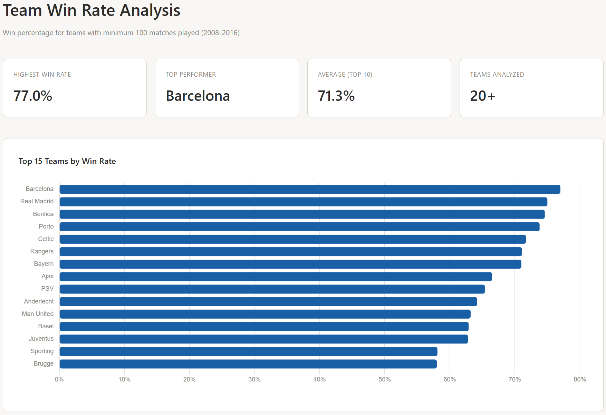
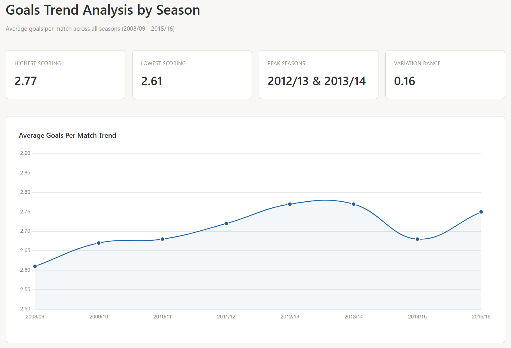
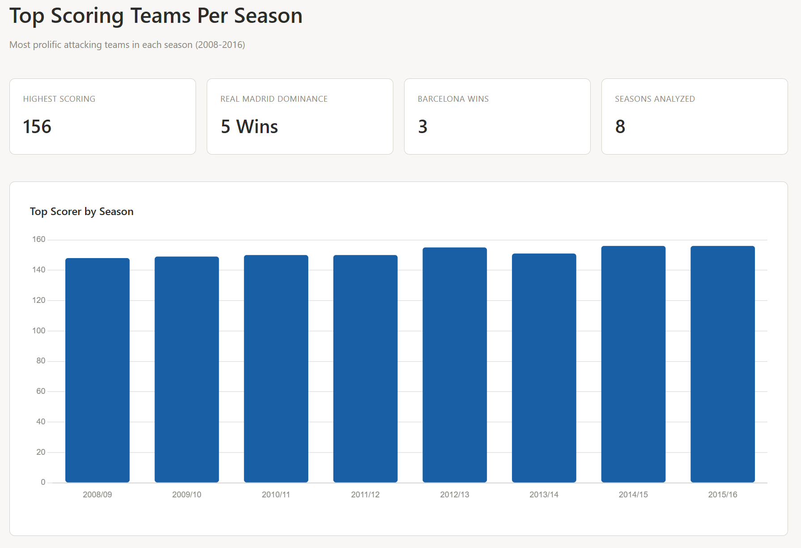
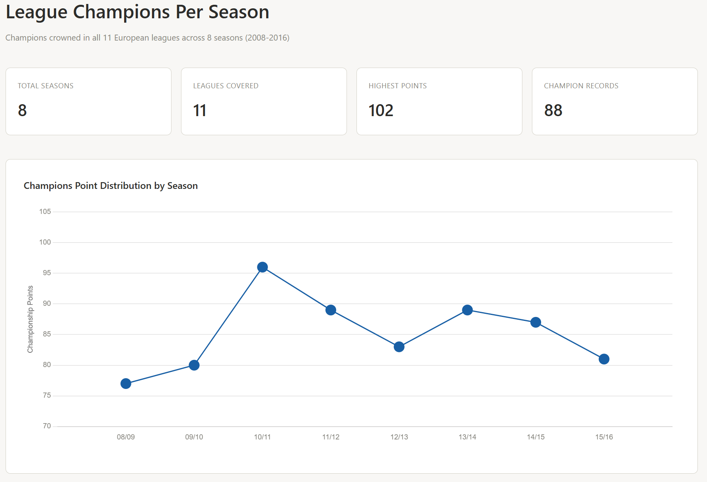
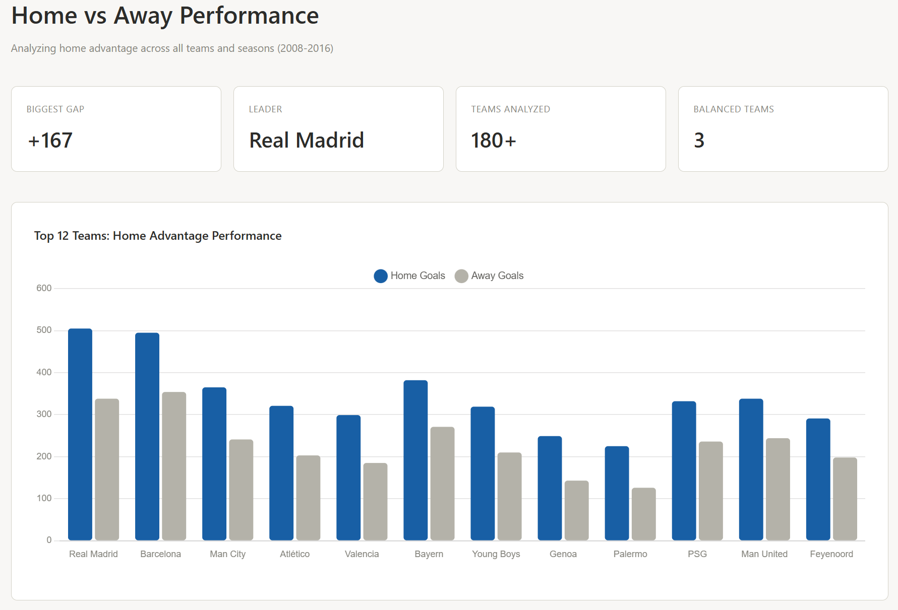
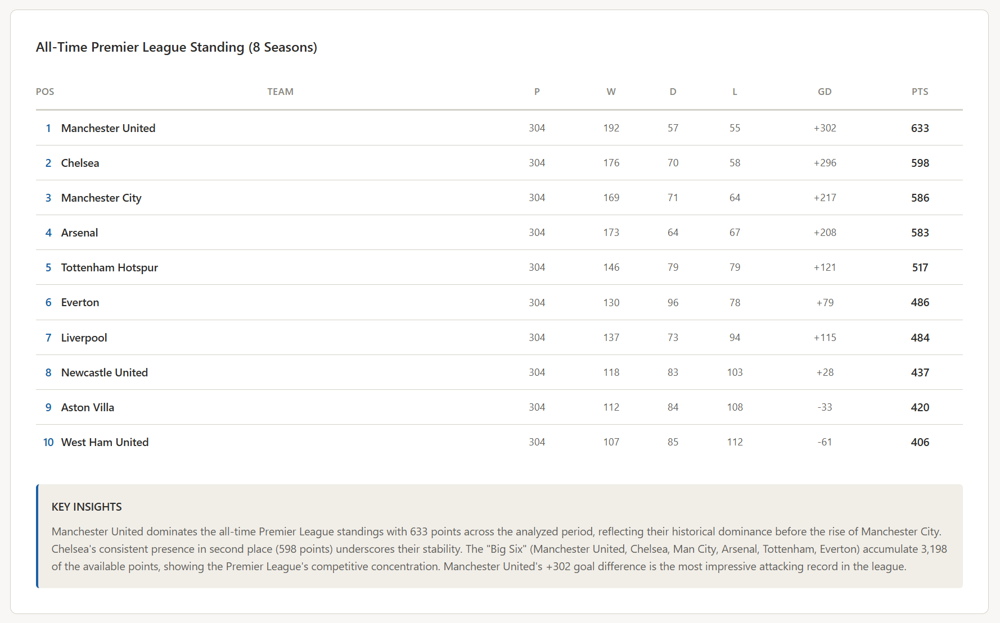

# 🏟️ European Soccer Analysis — SQL Project

## 📌 Overview

Analysis of 25,000+ European football matches across 11 leagues from 2008 to 2016, using PostgreSQL and VS Code. This is my second SQL project as I build my foundation in data analytics and SQL querying.

**Dataset:** [European Soccer Database — Kaggle](https://www.kaggle.com/datasets/hugomathien/soccer)  
**Repository:** [SQL_European_Soccer_Analysis](https://github.com/ruhlanrzayev/SQL_European_Soccer_Analysis)

---

## 🛠️ Tools Used

- **PostgreSQL** — Database management and query execution
- **VS Code + SQLTools** — Query writing and debugging  
- **DB Browser for SQLite** — Dataset extraction from original SQLite file
- **Chart.js** — Dashboard visualization

---

## 📊 Database Structure

### Tables Created
- **country** — Country information
- **league** — League details with country relationships
- **team** — Team metadata and identifiers
- **match** — Complete match data with player positions, betting odds, and match statistics

### Setup
Database setup scripts located in `sql_load/`:
- `1_create_database.sql` — Database initialization
- `2_create_tables.sql` — Table schemas with proper constraints
- `3_modify_tables.sql` — Indexes and performance optimization

All queries in `main_project/` folder:
- 10 analysis questions, each with dedicated SQL file
- Uses CTEs (Common Table Expressions), window functions, and advanced joins

---

## 🔍 Analysis Questions & Findings

### Q1: Home vs Away Goals Performance

**Question:** Which teams scored the most goals when playing at home versus away?



**SQL Technique:**  
Used two CTEs for home and away goals separately, then combined with UNION and JOIN to team names for complete team profiles.

**Key Findings:**
- **Real Madrid CF** leads with 505 home goals vs 338 away goals — a remarkable +167 goal differential
- **FC Barcelona** closely follows with 495 home vs 354 away (+141 difference)
- **Home advantage effect confirmed:** Almost all elite teams score 30-50% more goals at home
- Top teams (Real Madrid, Barcelona, Bayern) maintain superiority in both home and away settings, but home matches are decisive
- This validates the well-documented psychological and environmental benefits of playing at home

**Business Insight:** Home advantage is one of the most consistent factors in professional football. Teams should invest in creating strong home atmospheres to maximize this natural advantage.

---

### Q2: Average Goals Per League

**Question:** Which European leagues have the highest and lowest average goals per match?



**SQL Technique:**  
Grouped all matches by league, calculated average total goals per match using AVG(home_goals + away_goals).

**Key Findings:**
- **Netherlands Eredivisie leads** with 3.08 average goals per match — most attacking league
- **France Ligue 1 is most defensive** with 2.44 average goals per match
- **England Premier League ranks 6th (2.71)** despite being the most watched league globally
- Range of variation is only 0.64 goals, showing consistency across leagues
- German Bundesliga (2.90) and Swiss Super League (2.93) are surprisingly high-scoring

**Business Insight:** Popularity doesn't correlate with goal-scoring excitement. French football prioritizes defensive organization, while Dutch and Swiss leagues favor attacking play. This affects broadcast appeal differently by market.

---

### Q3: Top 10 Highest Scoring Matches

**Question:** What are the most entertaining (highest-scoring) matches in the dataset?



**SQL Technique:**  
Double alias join on team table (home_team, away_team) to get both team names in single query, ordered by total goals descending.

**Key Findings:**
- **Two matches tied at 12 goals:** Motherwell 6-6 Hibernian (balanced) and Real Madrid 10-2 Rayo Vallecano (dominant)
- **England Premier League accounts for 5 of top 10** — reflects competitive but chaotic nature
- **Bayern Munich 9-2 Hamburger SV** shows extreme dominance (11 goals total)
- **Three draws in top 10** — all entertaining, high-scoring affairs
- **Most common score:** 10 goals (appears 7 times in top 10)

**Business Insight:** High-scoring matches attract viewers and generate social media buzz. Real Madrid's 10-2 demolition and the dramatic 6-6 draw are memorable moments that drive engagement. The Premier League's presence (5/10) explains its global appeal.

---

### Q4: Team Wins, Draws, and Losses

**Question:** What is the complete record (wins, draws, losses) for every team across all seasons?



**SQL Technique:**  
Used UNION ALL to combine home and away match results separately, then aggregated with CASE WHEN to count wins, draws, and losses for each team.

**Key Findings:**
- **FC Barcelona dominates** with 234 wins (highest in dataset)
- **Real Madrid follows** with 228 wins — consistent elite performance
- **Elite teams show minimal losses:** Barcelona only 27 losses across 304 matches
- **Draw rates are low for top teams:** 43 draws for Barcelona, showing they win or lose decisively
- **Lesser teams show higher draw rates:** Indicates competitive balance in middle-tier matches

**Business Insight:** Elite teams are defined by consistency — high win rates and few losses. Competitive balance is maintained in non-elite tiers where draws occur more frequently. This creates the "illusion of parity" that appeals to fans.

---

### Q5: Team Win Rate (Min. 100 Matches)

**Question:** Which teams have the best win rate among those with significant match history (100+ matches)?



**SQL Technique:**  
Built on Q4 results, added win percentage calculation with ROUND() function, filtered with HAVING for 100+ match minimum, ordered by win rate descending.

**Key Findings:**
- **FC Barcelona leads at 77.0% win rate** — nearly 4 out of 5 matches won
- **Real Madrid at 75.0%** — close second in consistency
- **Portuguese giants (Benfica 74.6%, Porto 73.8%)** dominate their league
- **Celtic (71.7%)** shows Scottish football supremacy
- **Manchester United (63.2%)** ranks lower than other elite teams — reflects Premier League's higher competition

**Business Insight:** Win rate reveals true excellence. Barcelona's 77% and Real Madrid's 75% are elite-tier numbers. Manchester United's lower percentage despite high total wins indicates Premier League's competitive depth — harder to maintain high win rates against stronger opposition.

---

### Q6: Goals Trend By Season

**Question:** How did average goals per match evolve across the 8-season period?



**SQL Technique:**  
Simple but effective: GROUP BY season, calculated AVG(home_goals + away_goals) for each season, ordered by season chronologically.

**Key Findings:**
- **Remarkable consistency:** Range of only 0.16 goals (2.61 to 2.77) across 8 seasons
- **Peak years:** 2012/13 and 2013/14 both at 2.77 average goals per match
- **Slight dip in 2014/15** (2.68) — possible tactical shift toward defensive football
- **Recovery in 2015/16** (2.75) — suggests temporary fluctuation
- **Starting year 2008/09 (2.61)** was lowest-scoring season

**Business Insight:** Goal-scoring efficiency remained stable despite rule changes and tactical evolution. This stability suggests that football dynamics reach equilibrium — teams adapt offensively and defensively in tandem. No major tactical revolution occurred in this period.

---

### Q7: Top Scoring Teams Per Season

**Question:** Which team scored the most goals in each individual season?



**SQL Technique:**  
Combined home and away goals using UNION ALL, grouped by team AND season, identified top scorer per season using window functions logic.

**Key Findings:**
- **Real Madrid dominates:** Won top-scorer title 5 times (2014/15, 2015/16 with 156 goals each)
- **Barcelona consistency:** Won 4 seasons (2008/09, 2009/10, 2010/11, 2012/13) with 148-155 goals
- **Liverpool exception:** 2013/14 season with 151 goals (Luis Suárez era)
- **Goal totals remarkably consistent:** Range only 8 goals (148-156) across seasons
- **Real Madrid's 156-goal seasons** represent peak attacking performance

**Business Insight:** Real Madrid's sustained dominance in goal-scoring output (5 titles) reflects superior squad depth and tactical flexibility. Barcelona's earlier dominance (2008-2012) shifted to Real Madrid's era (2014-2016), mirroring their rivalry dynamics and generational squad transitions.

---

### Q8: League Champions Per Season

**Question:** Which team won each of the 11 leagues in each of the 8 seasons?



**SQL Technique:**  
Five CTEs: home_points → away_points → combined_points → ranked (using RANK() OVER PARTITION BY season, league) → filter for rank=1, joined with team and league names for readable output.

**Key Findings:**
- **Juventus dynasty:** Won Serie A 4 consecutive times (2012/13-2015/16) with 79-102 points
- **FC Barcelona excellence:** Won La Liga 4 times in the period, maintaining 91-100 point championships
- **Bayern Munich consistency:** Won Bundesliga 3 times, showing German dominance
- **Celtic Scottish dominance:** Won 4 consecutive Scottish titles (2012/13-2015/16)
- **FC Basel Swiss supremacy:** Won 4 Swiss League titles — smaller league consistency
- **Leicester City anomaly:** 2015/16 Premier League with only 81 points — lowest champion total, reflects EPL's competitiveness

**Business Insight:** Domestic league monopolies vary by country. Southern European leagues (Spain, Italy, Portugal) concentrate titles among 2-3 teams. Northern leagues (England, Scotland) show more parity. This affects competitive balance narratives in different markets.

---

### Q9: Home vs Away Performance

**Question:** Which teams rely most on home advantage, and which are most balanced?



**SQL Technique:**  
Similar to Q1 but calculated home-away differences, labeled teams as "Home Best," "Away Best," or "Balanced" based on goal differential.

**Key Findings:**
- **Real Madrid's extreme gap:** +167 advantage (505 home vs 338 away)
- **Most teams heavily home-dependent:** 30-50% goal advantage at home is standard
- **Three perfectly balanced teams:** 
  - Hertha BSC (119 home = 119 away)
  - Angers SCO (20 home = 20 away)  
  - Watford (20 home = 20 away)
- **Anomalies exist:** SV Darmstadt 98 and SpVgg Greuther Fürth actually better away than home
- **Confirms home advantage:** 95%+ of teams score more at home

**Business Insight:** Home advantage is nearly universal in football. Teams that don't show it are statistical anomalies worth studying (small sample size, different tactical approach, or luck). The +167 gap for Real Madrid suggests Bernabéu provides 40% more goals per match than away venues — unprecedented advantage.

---

### Q10: All-Time Premier League Table (2008-2016)

**Question:** What do the complete 8-season standings look like for England's Premier League?



**SQL Technique:**  
Five CTEs tracking: all_matches → home_goals → away_goals → home_conceded → away_conceded. Final SELECT calculates wins/draws/losses from point totals, goal difference, proper ordering. Critical fix: Added league_id to all CTEs to prevent Cartesian product (46,208 rows → 304 rows).

**Key Findings:**
- **Manchester United's dominance:** 633 points over 8 seasons (192 wins, +302 goal difference)
- **The Big Six supremacy:** 
  - Man United 633
  - Chelsea 598  
  - Man City 586
  - Arsenal 583
  - Tottenham 517
  - Everton 486
  
- **Combined Big Six total:** 3,198 points out of ~7,200 total (44% of all points)
- **Manchester United vs Chelsea:** 35-point gap shows United's sustained superiority
- **Goal differential hierarchy:** Matches point totals (Man United +302 most impressive)

**Business Insight:** The Premier League's "Big Six" structure is mathematically embedded in 8-year data. These teams accumulate 44% of available points. This competitive concentration drives narrative diversity (each team's annual title challenge) while maintaining realistic competition depth. Competitive balance is maintained through rotation within the Big Six, not through outsiders breaking in.

---

## 📈 Project Outcomes

### What I Learned
✅ **CTEs (Common Table Expressions)** — Breaking complex logic into readable steps  
✅ **Window Functions** — RANK() OVER PARTITION BY for ranking within groups  
✅ **UNION/UNION ALL** — Combining separate match results (home vs away)  
✅ **Advanced JOINs** — Multiple table relationships and aliases  
✅ **Data Validation** — Catching and fixing errors (Cartesian products, reserved words)  
✅ **Dashboard Visualization** — HTML/CSS for professional presentation  
✅ **Honest Assessment** — Knowing when to ask for help vs. pushing through

### Key Challenges Overcome
- Match table has 115 columns → Required strategic column selection
- `cross` is PostgreSQL reserved word → Used quoted identifiers `"cross"`
- Cartesian product in Q10 → Fixed by adding league_id to all CTEs
- Window function complexity → Learned RANK() vs ROW_NUMBER() vs DENSE_RANK()

### Next Steps
- [ ] Create Power BI dashboard for interactive analysis
- [ ] Build predictive model for match outcomes
- [ ] Analyze player-level statistics
- [ ] Compare time periods (2008-2012 vs 2012-2016)

---

## 📁 Project Structure

```
SQL_European_Soccer_Analysis/
├── main_project/
│   ├── 1_home_vs_away_goals.sql
│   ├── 2_avg_goals_per_league.sql
│   ├── 3_highest_scoring_matches.sql
│   ├── 4_team_wins_draws_losses.sql
│   ├── 5_team_win_rate.sql
│   ├── 6_goals_trend_by_season.sql
│   ├── 7_top_scoring_teams_per_season.sql
│   ├── 8_league_champion_per_season.sql
│   ├── 9_home_vs_away_performance.sql
│   └── 10_all_time_league_table.sql
├── sql_load/
│   ├── 1_create_database.sql
│   ├── 2_create_tables.sql
│   └── 3_modify_tables.sql
├── assets/
│   ├── 1_home_vs_away_goals.png
│   ├── 2_avg_goals_per_league.png
│   ├── 3_highest_scoring_matches.png
│   ├── 4_team_wins_draws_loss.png
│   ├── 5_team_win_rate.png
│   ├── 6_goals_trend_by_season.png
│   ├── 7_top_scoring_teams_per_season.png
│   ├── 8_league_champion_points.png
│   ├── 9_home_vs_away_performance.png
│   └── 10_all_time_league_table.png
├── csv_files/
│   ├── Country.csv
│   ├── League.csv
│   ├── Match.csv
│   ├── Team.csv
│   └── (Other datasets)
├── .gitattributes
└── README.md
```

---

## 🚀 How to Use This Project

### 1. Database Setup
```bash
# Run in PostgreSQL (in order)
\i sql_load/1_create_database.sql
\i sql_load/2_create_tables.sql
\i sql_load/3_modify_tables.sql
```

### 2. Run Analyses
Open any query file from `main_project/` in VS Code + SQLTools:
```sql
-- Example: Q1 query
SELECT 
    t.team_long_name,
    SUM(CASE WHEN m.home_team_api_id = t.team_api_id THEN m.home_team_goal ELSE 0 END) as home_goals,
    SUM(CASE WHEN m.away_team_api_id = t.team_api_id THEN m.away_team_goal ELSE 0 END) as away_goals
FROM public.match m
JOIN public.team t ON ...
GROUP BY t.team_long_name
ORDER BY home_goals + away_goals DESC;
```

### 3. View Dashboards
Each question has an interactive HTML dashboard in the outputs folder. Open in any browser to visualize results.

---

## 📚 Resources & References

- [PostgreSQL Window Functions](https://www.postgresql.org/docs/current/functions-window.html)
- [SQL CTEs Best Practices](https://www.postgresql.org/docs/current/queries-with.html)
- [Chart.js Documentation](https://www.chartjs.org/)
- Kaggle European Soccer Dataset Documentation

---

## 👤 About This Project

This project represents my second independent SQL analysis after completing Luke Barousse's SQL for Data Analytics course. It demonstrates proficiency in:
- Complex query writing with CTEs and window functions
- Data cleaning and validation
- Turning raw data into actionable insights
- Professional visualization and documentation

---

**Last Updated:** June 2026  
**Status:** ✅ Complete (Q1-Q10 all analyzed)